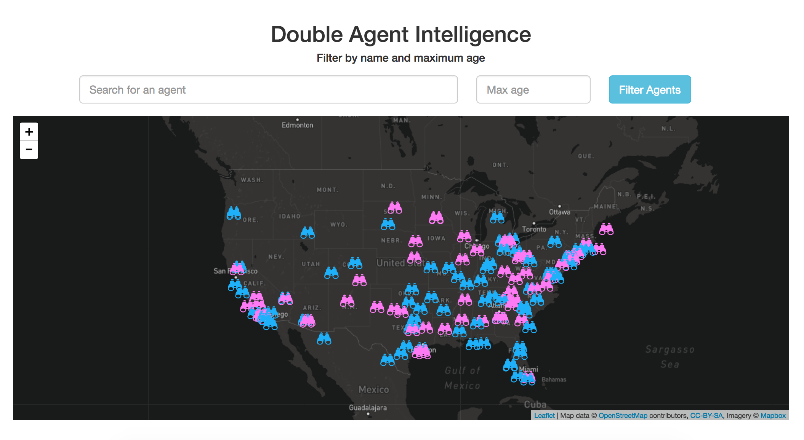

# [Double Agent Intelligence](http://double-agent-intel.herokuapp.com/)

  

A simple project that offered me a chance to learn how to configure a [Spring Boot](https://projects.spring.io/spring-boot/) backend server to serve location data, and then a [Bootstrap](http://getbootstrap.com/) and [LeafletJS](http://leafletjs.com/) front-end to visualize the data.
